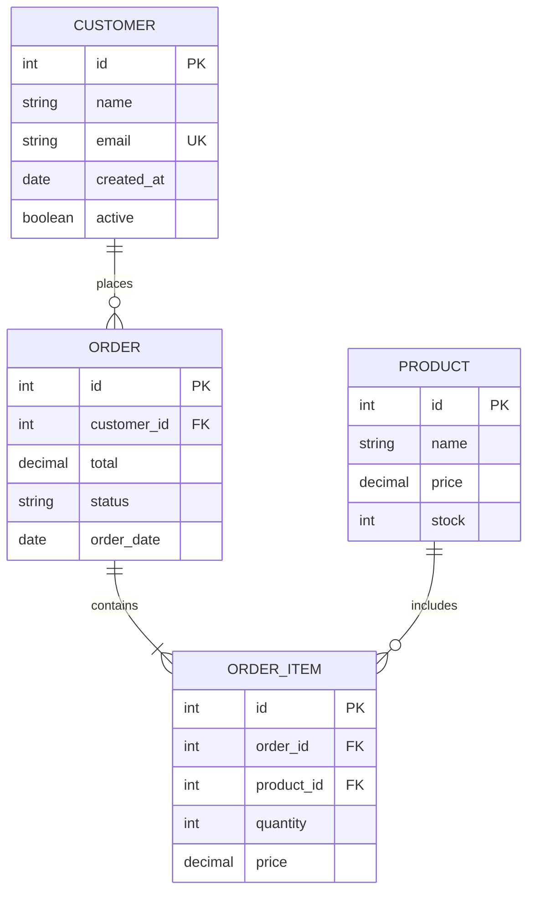
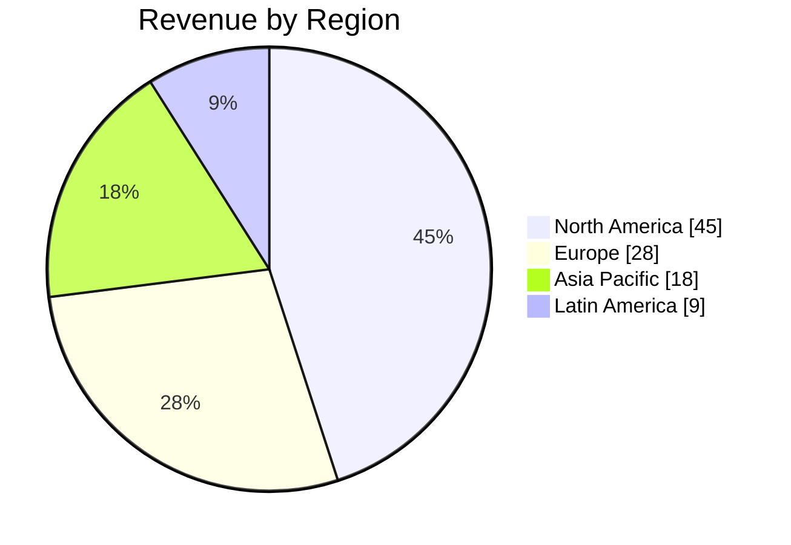
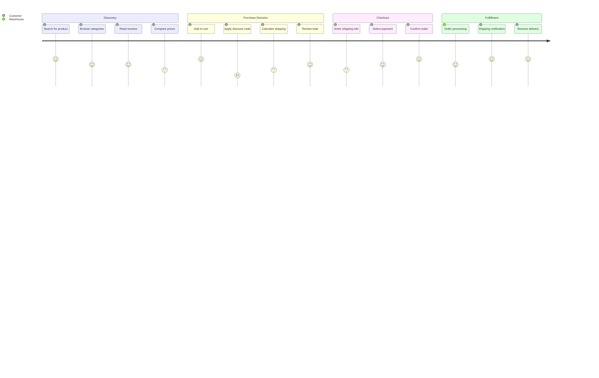
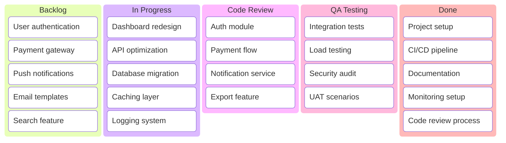
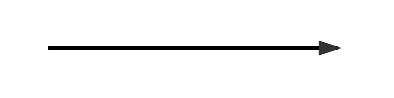
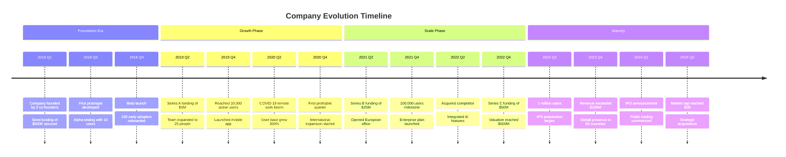
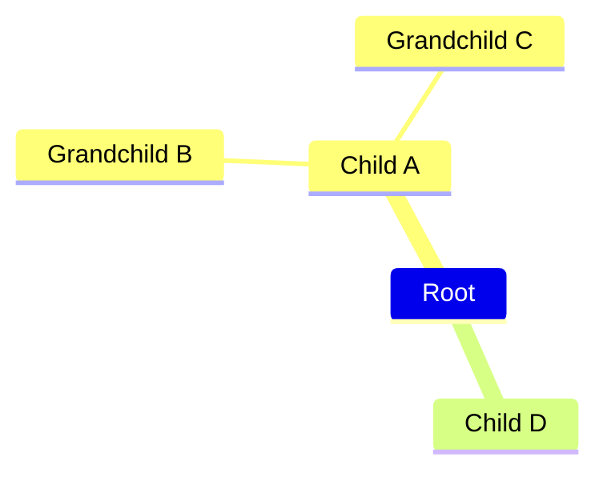

# Mermaid Syntax Reference - Comprehensive Documentation

> Official documentation: https://mermaid.js.org/intro/syntax-reference.html

---

## CLASSIFICATION SUMMARY (21 Diagram Types)

### GOLD - High Confidence LLM Generation (85-95%)
Simple syntax, predictable structure, easy validation

| Type | Mermaid Keyword | Confidence | Reason |
|------|-----------------|------------|--------|
| ER Diagram | `erDiagram` | 95% | Simple types, clear relationships, working in tests |
| Pie Chart | `pie` | 95% | Minimal syntax - just labels:values |
| User Journey | `journey` | 90% | Section/task structure, score 0-5, working in tests |
| Kanban | `kanban` | 90% | Column/card hierarchy, simple indentation, working in tests |
| Timeline | `timeline` | 85% | Simple period:event structure |
| Mindmap | `mindmap` | 85% | Indentation-based hierarchy |

### SILVER - Moderate Confidence (60-75%)
More complex syntax, requires careful prompt engineering

| Type | Mermaid Keyword | Confidence | Challenge |
|------|-----------------|------------|-----------|
| Flowchart | `flowchart` | 70% | Subgraph syntax, reserved words ("end"), node shapes |
| Gantt Chart | `gantt` | 70% | Date formats, dependency chains, milestone syntax |
| Quadrant Chart | `quadrantChart` | 70% | Coordinate precision, unique points, label overlap |
| XY Chart | `xychart` | 70% | Data array syntax, axis configuration |
| State Diagram | `stateDiagram-v2` | 65% | Composite states, fork/join, special states |
| Git Graph | `gitgraph` | 65% | Branch/commit order, cherry-pick dependencies |
| Block Diagram | `block` | 65% | Column layout, nesting, width spans |

### BRONZE - Challenging LLM Generation (40-55%)
Complex syntax, specialized domains, many edge cases

| Type | Mermaid Keyword | Confidence | Challenge |
|------|-----------------|------------|-----------|
| Sequence Diagram | `sequenceDiagram` | 55% | Many arrow types, activation stacking, control structures |
| Class Diagram | `classDiagram` | 55% | Visibility modifiers, relationships, generics |
| Requirement Diagram | `requirementDiagram` | 50% | Multiple types, verification methods, relationship arrows |
| Packet Diagram | `packet` | 50% | Bit range syntax, field sizing |
| C4 Diagram | `C4Context` | 45% | PlantUML-like syntax, many element types, manual layout |
| Architecture | `architecture-beta` | 45% | Beta syntax, group nesting, edge directions |
| Sankey Diagram | `sankey` | 40% | CSV-like format, flow balancing, special characters |
| ZenUML | `zenuml` | 40% | Different paradigm, code-like syntax |

---

# GOLD TIER DIAGRAMS

## 1. ER DIAGRAM (erDiagram) - 95% Confidence

### Declaration
```mermaid
erDiagram
```

### Entity Definition
```mermaid
ENTITY_NAME {
    type attribute_name PK
    type attribute_name FK
    type attribute_name UK
}
```

### CRITICAL: Use Only Simple Types
| Type | Description |
|------|-------------|
| `int` | Integer |
| `string` | Text (NOT varchar) |
| `date` | Date (NOT datetime) |
| `boolean` | True/false |
| `decimal` | Decimal number |

**DO NOT USE**: `VARCHAR`, `DATETIME`, `BIGINT`, `TEXT`, `FLOAT`, etc.

### Relationship Syntax
```
ENTITY1 <cardinality> ENTITY2 : label
```

### Cardinality Notation
| Left Side | Meaning | Right Side |
|-----------|---------|------------|
| `\|o` | Zero or one | `o\|` |
| `\|\|` | Exactly one | `\|\|` |
| `}o` | Zero or more | `o{` |
| `}\|` | One or more | `\|{` |

### Complete Example


### CRITICAL RULES
1. **Use ONLY simple types**: int, string, date, boolean, decimal
2. **Do NOT use SQL types** like VARCHAR, DATETIME, BIGINT, TEXT
3. **Keep attribute names short** (max 15 chars)
4. **Use snake_case** for attribute names
5. **Include 3-6 entities** with 3-6 attributes each
6. **Relationship labels** should be single words when possible

---

## 2. PIE CHART (pie) - 95% Confidence

### Declaration


### Complete Example


### CRITICAL RULES
1. **Values must be positive numbers**
2. **Labels must be in quotes**
3. **Use colon separator** between label and value
4. **Slices render clockwise** in order listed
5. **showData** displays actual values on chart

---

## 3. USER JOURNEY (journey) - 90% Confidence

### Declaration
```mermaid
journey
```

### Section Syntax
```mermaid
section Section Name
    Task description: score: Actor1, Actor2
```

### CRITICAL: Score Range is 0-5 (NOT 0-10!)
| Score | Meaning | Color |
|-------|---------|-------|
| 5 | Excellent | Green |
| 4 | Good | Light Green |
| 3 | Neutral | Yellow |
| 2 | Poor | Orange |
| 1 | Bad | Red |
| 0 | Terrible | Dark Red |

### Complete Example


### CRITICAL RULES
1. **Scores MUST be integers 0-5**
2. **NEVER use 10, 7, 8** - max is 5
3. **Vary scores** to show journey ups and downs
4. **Do NOT include title** - slide has its own title
5. **Each section** should have 3-5 tasks

---

## 4. KANBAN (kanban) - 90% Confidence

### Declaration
```mermaid
kanban
```

### Column Syntax
```mermaid
columnId[Column Title]
```

### Task/Card Syntax (indented under column)
```mermaid
    taskId[Task Description]
```

### Task with Metadata
```mermaid
    taskId[Description]@{ assigned: 'John', priority: 'High' }
```

### Metadata Options
| Key | Values |
|-----|--------|
| `assigned` | Person name |
| `ticket` | Issue number |
| `priority` | 'Very High', 'High', 'Low', 'Very Low' |

### Complete Example


### CRITICAL RULES
1. **Use native kanban syntax** - NOT flowchart with subgraphs
2. **Each column MUST have 4-5 cards minimum**
3. **Include 4-5 columns** for complete workflow
4. **Total 16-25 cards** for visual balance
5. **Short descriptions** (max 20 chars)
6. **Proper indentation** - tasks must be indented under columns
7. **Unique IDs** for all columns and tasks

---

## 5. TIMELINE (timeline) - 85% Confidence

### Declaration


### Basic Syntax
```mermaid
time_period : event_description
```

### Multiple Events per Period
```mermaid
2024 : Event one
     : Event two
     : Event three
```

### Section Syntax
```mermaid
section Era Name
    2020 : Major milestone
    2021 : Another event
```

### Complete Example


### CRITICAL RULES
1. **Simple text only** - no special formatting in events
2. **Chronological order** - earliest to latest (left to right)
3. **Use sections** to group related time periods
4. **Line breaks** use `<br>` tag if needed
5. **Time formats** are flexible - years, dates, or descriptive text

---

## 6. MINDMAP (mindmap) - 85% Confidence

### Declaration
```mermaid
mindmap
```

### Basic Structure


### Node Shapes
- **Default:** Rounded rectangles
- **Square:** `[text]`
- **Rounded:** `(text)`
- **Circle:** `((text))`
- **Cloud:** `{{text}}`

### Complete Example
```mermaid
mindmap
    Project Planning
        Requirements
            User Stories
            Technical Specs
            Acceptance Criteria
        Design
            UI Mockups
            Architecture
            Database Schema
        Development
            Frontend
            Backend
            Testing
        Deployment
            Staging
            Production
            Monitoring
```

### CRITICAL RULES
1. **Indentation determines hierarchy**
2. **One root node required**
3. **Use consistent indentation** (spaces, not tabs)
4. **Keep node text concise**

---

# SILVER TIER DIAGRAMS

## 7. FLOWCHART (flowchart) - 70% Confidence

### Declaration
```mermaid
flowchart [DIRECTION]
```
- **Directions**: `TB` (top-bottom), `TD` (top-down), `BT` (bottom-top), `LR` (left-right), `RL` (right-left)
- **Alias**: `graph` works the same as `flowchart`

### Node Shapes
| Shape | Syntax | Use Case |
|-------|--------|----------|
| Rectangle | `A[Text]` | Standard step |
| Rounded | `A(Text)` | Process |
| Stadium | `A([Text])` | Start/End |
| Subroutine | `A[[Text]]` | Sub-process |
| Cylinder | `A[(Text)]` | Database |
| Circle | `A((Text))` | Event |
| Diamond | `A{Text}` | Decision |
| Hexagon | `A{{Text}}` | Preparation |
| Parallelogram | `A[/Text/]` | Input/Output |
| Double Circle | `A(((Text)))` | Double event |

### Arrow/Link Types
| Type | Syntax | Description |
|------|--------|-------------|
| Standard | `-->` | Normal arrow |
| Open | `---` | No arrowhead |
| Dotted | `-.->` | Dotted with arrow |
| Thick | `==>` | Thick with arrow |
| With Label | `-->\|text\|` | Arrow with label |
| Bidirectional | `<-->` | Two-way arrow |

### Subgraphs
```mermaid
subgraph ID["Title"]
    direction LR
    A --> B
end
```

### Styling
```mermaid
classDef className fill:#f9f,stroke:#333
class nodeId className
A:::className
```

### Complete Example
```mermaid
flowchart TD
    subgraph Input["Input Phase"]
        direction LR
        A([Start]) --> B[Receive Data]
        B --> C[Validate]
    end

    subgraph Process["Processing"]
        direction LR
        D[Transform] --> E[Enrich]
        E --> F[Store]
    end

    subgraph Output["Output Phase"]
        direction LR
        G[Format] --> H[Send]
        H --> I([Complete])
    end

    Input --> Process
    Process --> Output

    C -->|Invalid| J[Error Handler]
    J -.-> A

    classDef critical fill:#ff6b6b,stroke:#c92a2a,color:#fff
    classDef success fill:#51cf66,stroke:#37b24d,color:#fff

    class J critical
    class I success
```

### CRITICAL RULES
1. **Always specify direction** after `flowchart` (e.g., `flowchart TD`)
2. **Use quotes for special characters** in node text
3. **Reserved word "end"** - use `End` or `"end"` in quotes
4. **Node IDs starting with "o" or "x"** need special handling
5. **Subgraph syntax** - must end with `end` keyword

---

## 8. GANTT CHART (gantt) - 70% Confidence

### Declaration
```mermaid
gantt
    dateFormat YYYY-MM-DD
    axisFormat %b
```

### Date Format Tokens (dateFormat)
| Token | Output |
|-------|--------|
| `YYYY` | 4-digit year |
| `MM` | 2-digit month |
| `DD` | 2-digit day |

### Axis Format Tokens (axisFormat)
| Token | Output |
|-------|--------|
| `%b` | Month abbreviation (Jan, Feb) - PREFERRED |
| `%m/%d` | Month/Day numbers |
| `%Y` | Year only |

### Task Syntax
```
Task Name: [tags], taskId, start_date_or_dependency, duration
```

### Tags (must come first)
| Tag | Effect |
|-----|--------|
| `done` | Completed (gray) |
| `active` | In progress (blue) |
| `crit` | Critical path (red) |
| `milestone` | Milestone marker (duration must be 0d) |

### Dependencies
- `after taskId` - start after another task
- `after task1 task2` - start after multiple tasks

### Complete Example
```mermaid
gantt
    dateFormat YYYY-MM-DD
    axisFormat %b
    excludes weekends

    section Planning
    Project kickoff: done, kick, 2024-01-08, 3d
    Requirements: active, req, after kick, 14d
    Design: des, after req, 21d

    section Development
    Backend API: crit, back, after des, 28d
    Frontend: crit, front, after des, 35d
    Database: db, after back, 14d
    Integration: int, after front db, 14d

    section Testing
    Unit tests: unit, after int, 7d
    Integration tests: test, after unit, 14d
    UAT: crit, uat, after test, 14d

    section Launch
    Staging: stage, after uat, 7d
    Go live: milestone, live, after stage, 0d
    Support: support, after live, 21d
```

### CRITICAL RULES
1. **Do NOT include title** - slide has title
2. **Always use `axisFormat %b`** for month abbreviations
3. **Milestones MUST have duration `0d`**
4. **Valid tags are ONLY**: done, active, crit, milestone
5. **Use realistic durations** (days `d` or weeks `w`)
6. **Include 3-4 sections** with 3-5 tasks each

---

## 9. QUADRANT CHART (quadrantChart) - 70% Confidence

### Declaration
```mermaid
quadrantChart
```

### Axis Syntax
```mermaid
x-axis Left Label --> Right Label
y-axis Bottom Label --> Top Label
```

### Quadrant Labels
```mermaid
quadrant-1 Top Right Label
quadrant-2 Top Left Label
quadrant-3 Bottom Left Label
quadrant-4 Bottom Right Label
```

### Quadrant Positions
| Quadrant | Position | X Range | Y Range |
|----------|----------|---------|---------|
| quadrant-1 | Top Right | 0.5-1.0 | 0.5-1.0 |
| quadrant-2 | Top Left | 0.0-0.5 | 0.5-1.0 |
| quadrant-3 | Bottom Left | 0.0-0.5 | 0.0-0.5 |
| quadrant-4 | Bottom Right | 0.5-1.0 | 0.0-0.5 |

### Point Syntax
```mermaid
Point Name: [x, y]
```
- Coordinates are 0.0 to 1.0

### Point Styling
```mermaid
Point A: [0.9, 0.8] radius: 12
Point B: [0.7, 0.6] color: #ff3300
```

### Complete Example
```mermaid
quadrantChart
    x-axis Low Impact --> High Impact
    y-axis Low Probability --> High Probability

    quadrant-1 Critical
    quadrant-2 Monitor
    quadrant-3 Low Priority
    quadrant-4 Mitigate

    Data Breach: [0.92, 0.88]
    System Down: [0.78, 0.75]
    Key Person: [0.65, 0.68]

    Minor Delays: [0.22, 0.85]
    Team Conflicts: [0.35, 0.72]
    Doc Issues: [0.18, 0.65]

    Office Issues: [0.12, 0.18]
    Training Gaps: [0.28, 0.32]
    Hardware: [0.38, 0.25]

    Natural Disaster: [0.88, 0.15]
    Tech Obsolete: [0.72, 0.28]
    Vendor Fail: [0.82, 0.38]
```

### CRITICAL RULES
1. **Do NOT include title** - slide has title
2. **Each point MUST have UNIQUE coordinates**
3. **Minimum 0.08 difference** between any two x or y values
4. **Spread points across ALL quadrants** (2-4 per quadrant)
5. **Use short labels** (max 15 chars) to avoid overlap
6. **Total 8-12 points** for good visual balance
7. **Quadrant labels** should be 1-2 words max

---

## 10. XY CHART (xychart) - 70% Confidence

### Declaration
```mermaid
xychart
xychart horizontal
```

### Axis Syntax
```mermaid
x-axis title min --> max          %% numeric range
x-axis "title" [cat1, cat2, cat3] %% categorical
y-axis title min --> max          %% with range
y-axis title                      %% auto-generated range
```

### Data Series
```mermaid
line [2.3, 45, .98, -3.4]
bar [2.3, 45, .98, -3.4]
```

### Complete Example
```mermaid
xychart
    title "Monthly Sales Performance"
    x-axis [Jan, Feb, Mar, Apr, May, Jun]
    y-axis "Revenue ($K)" 0 --> 100
    bar [23, 45, 56, 78, 65, 89]
    line [20, 42, 50, 70, 60, 82]
```

### CRITICAL RULES
1. Single-word text values don't require quotes
2. Multi-word text requires double quotes
3. Both axes are optional; ranges auto-generate from data if omitted
4. Supports negative and decimal values

---

## 11. STATE DIAGRAM (stateDiagram-v2) - 65% Confidence

### Declaration
```mermaid
stateDiagram-v2
```

### States and Transitions
```mermaid
[*] --> State1
State1 --> State2: transition
State2 --> [*]
```

### Composite States
```mermaid
state CompositeState {
    [*] --> SubState1
    SubState1 --> SubState2
}
```

### Special States
- Fork: `state fork <<fork>>`
- Join: `state join <<join>>`
- Choice: `state choice <<choice>>`

### Notes
```mermaid
note right of State1
    This is a note
end note
```

### Direction
```mermaid
direction LR
```

---

## 12. GIT GRAPH (gitgraph) - 65% Confidence

### Declaration
```mermaid
gitgraph
```

### Basic Operations
```mermaid
gitgraph
    commit
    branch develop
    checkout develop
    commit
    checkout main
    merge develop
    commit tag: "v1.0"
```

### Commit Attributes
- `commit id: "custom_id"`
- `commit type: HIGHLIGHT` (or NORMAL, REVERSE)
- `commit tag: "v1.0"`

### Orientation
- `LR:` (Left-to-Right, default)
- `TB:` (Top-to-Bottom)
- `BT:` (Bottom-to-Top)

---

## 13. BLOCK DIAGRAM (block) - 65% Confidence

### Declaration
```mermaid
block
```

### Column Configuration
```mermaid
block
    columns 3
    a b c
    d:2 e
```

### Connections
```mermaid
A --> B
A --- B
A -->|label| B
```

---

# BRONZE TIER DIAGRAMS

## 14. SEQUENCE DIAGRAM (sequenceDiagram) - 55% Confidence

### Declaration
```mermaid
sequenceDiagram
    participant A
    participant B
```

### Message Types
| Arrow | Style |
|-------|-------|
| `->` | Solid, no arrowhead |
| `-->` | Dotted, no arrowhead |
| `->>` | Solid with arrowhead |
| `-->>` | Dotted with arrowhead |
| `-x` | Solid with cross |
| `--x` | Dotted with cross |
| `-)` | Solid async |
| `--)` | Dotted async |

### Activations
```mermaid
A->>+B: Message
B-->>-A: Response
```

### Control Structures
- `loop`, `alt/else`, `opt`, `par`, `break`, `critical`

---

## 15. CLASS DIAGRAM (classDiagram) - 55% Confidence

### Declaration
```mermaid
classDiagram
    class Animal {
        +int age
        +String gender
        +isMammal() bool
    }
    Animal <|-- Dog
```

### Visibility Modifiers
| Symbol | Access Level |
|--------|-------------|
| `+` | Public |
| `-` | Private |
| `#` | Protected |
| `~` | Package/Internal |

### Relationship Types
| Syntax | Relationship |
|--------|-------------|
| `<\|--` | Inheritance |
| `*--` | Composition |
| `o--` | Aggregation |
| `-->` | Association |
| `..\>` | Dependency |
| `..\|>` | Realization |

---

## 16. REQUIREMENT DIAGRAM (requirementDiagram) - 50% Confidence

### Declaration
```mermaid
requirementDiagram
    requirement test_req {
        id: 1
        text: The test requirement
        risk: high
        verifymethod: test
    }
    element test_entity {
        type: simulation
    }
    test_entity - satisfies -> test_req
```

### Requirement Types
requirement, functionalRequirement, interfaceRequirement, performanceRequirement, physicalRequirement, designConstraint

### Risk Levels
Low, Medium, High

### Verification Methods
Analysis, Inspection, Test, Demonstration

---

## 17. C4 DIAGRAM (C4Context) - 45% Confidence

### Declaration Types
- `C4Context` - System context diagrams
- `C4Container` - Container diagrams
- `C4Component` - Component diagrams
- `C4Dynamic` - Dynamic diagrams
- `C4Deployment` - Deployment diagrams

### Core Elements
```mermaid
C4Context
    Person(user, "User", "A user of the system")
    System(system, "System", "Main system")
    Rel(user, system, "Uses")
```

---

## 18. ARCHITECTURE DIAGRAM (architecture-beta) - 45% Confidence

### Declaration
```mermaid
architecture-beta
```

### Groups and Services
```mermaid
group public_api(cloud)[Public API]
service database1(database)[Database] in public_api
service server(server)[Server]
database1:R --> L:server
```

---

## 19. SANKEY DIAGRAM (sankey) - 40% Confidence

### Declaration
```mermaid
sankey
source,target,value
Node1,Node2,100
Node2,Node3,75
```

### Notes
- CSV-like format with 3 columns: source, target, value
- Special characters in node names require quotes

---

## 20. PACKET DIAGRAM (packet) - 50% Confidence

### Declaration
```mermaid
packet
0-7: "Version"
8-15: "Header Length"
16-31: "Total Length"
```

---

## 21. ZENUML (zenuml) - 40% Confidence

Different paradigm from standard Mermaid - uses code-like syntax.

```mermaid
zenuml
    A.method() {
        B.call()
    }
```

---

## Common Issues & Fixes

### Issue 1: "All generation methods failed"
**Cause**: LLM generates invalid syntax
**Fix**: Ensure LLM follows exact syntax patterns above

### Issue 2: Special characters breaking diagrams
**Fix**: Use quotes around text with special chars: `"text with : colon"`

### Issue 3: Reserved word "end"
**Fix**: Capitalize as `End` or use quotes `"end"`

### Issue 4: Journey scores above 5
**Fix**: CRITICAL - scores must be 0-5, not 0-10

### Issue 5: Gantt with title
**Fix**: Remove title - slide provides its own title

### Issue 6: ER Diagram with SQL types
**Fix**: Use only simple types: int, string, date, boolean, decimal

### Issue 7: Quadrant points overlapping
**Fix**: Ensure unique coordinates with minimum 0.08 difference

---

## Implementation Priority

### Phase 1: Focus on GOLD tier (6 types)
These are reliable and should work well with current LLM setup:
- erDiagram, pie, journey, kanban, timeline, mindmap

### Phase 2: Improve SILVER tier (7 types)
Requires enhanced prompt engineering and validation:
- flowchart, gantt, quadrantChart, xychart, stateDiagram-v2, gitgraph, block

### Phase 3: Consider BRONZE tier (8 types)
Only if business need justifies the complexity:
- sequenceDiagram, classDiagram, requirementDiagram, packet, C4*, architecture-beta, sankey, zenuml

---

## References

- [Mermaid Syntax Reference](https://mermaid.js.org/intro/syntax-reference.html)
- [Flowchart Documentation](https://mermaid.js.org/syntax/flowchart.html)
- [ER Diagram Documentation](https://mermaid.js.org/syntax/entityRelationshipDiagram.html)
- [User Journey Documentation](https://mermaid.js.org/syntax/userJourney.html)
- [Gantt Chart Documentation](https://mermaid.js.org/syntax/gantt.html)
- [Quadrant Chart Documentation](https://mermaid.js.org/syntax/quadrantChart.html)
- [Timeline Documentation](https://mermaid.js.org/syntax/timeline.html)
- [Kanban Documentation](https://mermaid.js.org/syntax/kanban.html)
- [Sequence Diagram Documentation](https://mermaid.js.org/syntax/sequenceDiagram.html)
- [Class Diagram Documentation](https://mermaid.js.org/syntax/classDiagram.html)
- [State Diagram Documentation](https://mermaid.js.org/syntax/stateDiagram.html)
- [Pie Chart Documentation](https://mermaid.js.org/syntax/pie.html)
- [Mindmap Documentation](https://mermaid.js.org/syntax/mindmap.html)
- [Git Graph Documentation](https://mermaid.js.org/syntax/gitgraph.html)
- [C4 Diagram Documentation](https://mermaid.js.org/syntax/c4.html)
- [Sankey Diagram Documentation](https://mermaid.js.org/syntax/sankey.html)
- [XY Chart Documentation](https://mermaid.js.org/syntax/xyChart.html)
- [Block Diagram Documentation](https://mermaid.js.org/syntax/block.html)
- [Architecture Documentation](https://mermaid.js.org/syntax/architecture.html)
- [Requirement Diagram Documentation](https://mermaid.js.org/syntax/requirementDiagram.html)
- [Packet Diagram Documentation](https://mermaid.js.org/syntax/packet.html)
- [ZenUML Documentation](https://mermaid.js.org/syntax/zenuml.html)
